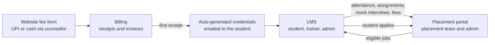

 

---

## ⚡ Impact at a Glance

| 🗂️ **40+ → 1** | 📡 **10,000+** | 👥 **40+** | 🌐 **5,000+** | 🚀 **30–40%** |
|:---:|:---:|:---:|:---:|:---:|
| repositories merged into one monorepo | intrusion panels served by the platform | operators receiving real-time alerts | active users across production MERN apps | faster app performance with SSR |

---

## 👋 About Me

I am a **full-stack engineer** who ships production software end to end: database design, backend APIs, real-time pipelines and the user interface. In about two years I have worked on two very different kinds of systems:

- **A real-time Central Monitoring Station platform**, where a missed event has real consequences
- **An interconnected education business platform** (Billing, LMS, Placement) that takes a student from first payment to a job application

I care about reliable architecture, secure access control, clean maintainable code and documentation other engineers can actually use.

---

## 💼 Experience

### Integrated Active Monitoring Pvt. Ltd. · Full Stack Software Engineer
*June 2026 – Present*

- Merged **40+ repositories into one monorepo** with shared pipeline logic and panel-specific event processing
- Built the **real-time event pipeline** (RabbitMQ, WebSockets, PostgreSQL) delivering fire, door and ATM alerts to **40+ operators**
- Delivered a **9-sheet Excel bulk import/export** module with validation, preview and atomic commits
- Implemented **MFA/OTP, RBAC, account lockout and InfluxDB audit logging**
- Extended the **licensing system** to support multiple application types per license

### SevenMentor Corporate Services · Full Stack Developer (Full-Time Employee)
*February 2025 – May 2026*

- Developed and maintained **5+ production MERN applications** serving **5,000+ active users**
- Worked across the **Billing, LMS, Placement and CMS** platforms as one connected system
- Built **JWT authentication with RBAC**, **email workflows** (NodeMailer with OAuth2), and **REST APIs** under concurrent load
- Improved performance by **30–40%** with **server-side rendering (SSR)** and cut development time by about **25%** with a reusable UI component library

---

## 🛡️ Platform 1: Central Monitoring Station

A horizontally scalable platform that receives events from **intrusion, fire and access-control panels** from many vendors, and delivers them to operators and field engineers in real time.

| Engineering focus | How it works |
|-------------------|--------------|
| **Many protocols, one pipeline** | Each panel family has its own receiver that decodes the vendor protocol into one canonical event, so everything downstream is shared |
| **Schema-first validation** | Every cross-process message is a strict Pydantic model, and malformed data is rejected at the edge |
| **Resilient messaging** | Auto-reconnecting consumers with exponential back-off, and retries on delivery to the Event Manager |
| **Duplicate-safe delivery** | Each event carries a unique ID, so a retry can never fan out the same notification twice |
| **Real-time operator portal** | React app over WebSockets with live event grid, acknowledge / reset, site snooze and keep-alive |
| **Heartbeat and telemetry** | Panel health tracked through heartbeats, with analog telemetry stored in InfluxDB |
| **Observable and reproducible** | Prometheus metrics on every worker, and images built only from clean, tagged releases |
| **Field tooling** | A mobile-first engineer app that explains a site's problems in plain language |

---

## 🎓 Platform 2: Billing + LMS + Placement (SevenMentor)

Three separate platforms, each with its own database, **integrated into one flow** that carries a student from fee payment to a job application.

### 💳 Billing
- Fee details collected through a form on the website, with payments by **UPI** or **cash collected by a counsellor**, and the collector recorded on every entry
- Receipt and invoice generation and all billing records
- **The first receipt triggers an email with auto-generated credentials** to the student, which unlocks the courses they enrolled in

### 📚 LMS
- **Student:** manage profile, resume, education and qualifications, and see scheduled lectures, delays, recorded sessions, holidays and mock interviews
- **Trainer:** schedule classes, update the syllabus, take attendance and upload recorded sessions
- **Admin:** create trainer and student users with role-based access, and manage classrooms, courses, batches and assignments, including which batch gets which course

### 💼 Placement
- Portal restricted to the **placement team and admin**, managing tie-up **companies and HRs** and the jobs they post
- Student eligibility driven by LMS performance: **attendance, assignments, mock interviews and fee completion**
- Eligible jobs appear in the student's **LMS login**, and when a student applies, the placement team sees **who applied for which job**

---

## 🛠️ Tech Stack

**Also:** SQLAlchemy · Pydantic · WebSockets · InfluxDB · Prometheus · JWT · MFA/OTP · RBAC · NodeMailer · Jest · Webpack · CI/CD

## 🤝 Let's Connect

If you are hiring, or want to talk about reliable backends, real-time systems or full-stack platforms, reach me on [LinkedIn](https://www.linkedin.com/in/ganesh-kumbhar-fullstack-developer), at [gktechhub.com](https://gktechhub.com) or by [email](mailto:ganeshhh2003@gmail.com).

